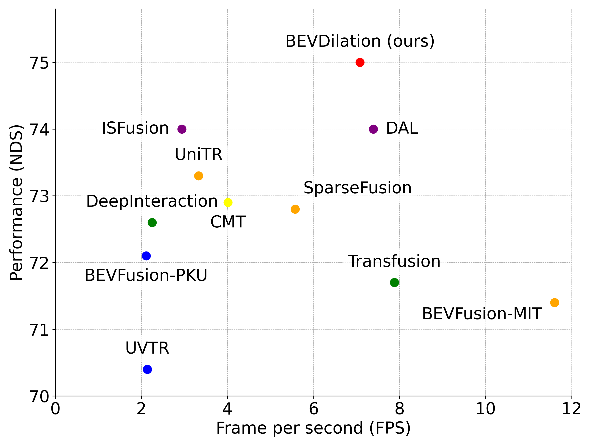

# BEVDilation: LiDAR-Centric Multi-Modal Fusion for 3D Object Detection

[]()

This repo is the official implementation of AAAI26 paper [BEVDilation: LiDAR-Centric Multi-Modal Fusion for 3D Object Detection](). Our BEVDilation achieves state-of-the-art performance on nuScene datasets. It prioritizes LiDAR information in the multi-modal fusion, achieving effective and robust fusion.

## 🔥News
<!-- -[25-11-24] BEVDilation released on [arxiv](https://arxiv.org/abs/2406.10700)    -->
-[25-11-24] BEVDilation is accepted by **AAAI26**!

## 📘TODO
- [ ] Release the [arXiv]() version.
- [ ] Clean up and release the code.
<!-- - [x] Release code of Waymo.
- [ ] Release code of NuScenes.
- [ ] Release code of ERFs visualization.
- [ ] Merge Voxel Mamba to [OpenPCDet](https://github.com/open-mmlab/OpenPCDet). -->

## 🏆Main Results
<!-- #### Waymo Open Dataset
Validation set  
|  Model  | mAPH_L1 | mAPH_L2 | Veh_L1 | Veh_L2 | Ped_L1 | Ped_L2 | Cyc_L1 | Cyc_L2 | Log |
|---------|--------|--------|--------|--------|--------|--------|--------|--------|--------|
|  [Voxel Mamba](tools/cfgs/voxel_mamba_models/voxel_mamba_waymo.yaml) | 79.6  |  73.6  | 80.8/80.3 | 72.6/72.2 | 85.0/80.8 | 77.7/73.6 | 78.6/77.6 | 75.7/74.8 | [Log](https://drive.google.com/file/d/1Kq7WR9OV2kByKUUkurZp878mERKWBJi5/view?usp=sharing) | 

Test set
|  Model  | mAPH_L1 | mAPH_L2 | Veh_L1 | Veh_L2 | Ped_L1 | Ped_L2 | Cyc_L1 | Cyc_L2 | Leaderboard |
|---------|--------|--------|--------|--------|--------|--------|--------|--------|--------|
|  [Voxel Mamba](tools/cfgs/voxel_mamba_models/voxel_mamba_waymo.yaml) | 79.6  |  74.3  | 84.4/84.0 | 77.0/76.6 | 84.8/80.6 | 79.0/74.9 | 75.4/74.3 | 72.6/71.5 | [leaderboard](https://waymo.com/open/challenges/detection-3d/results/d57ccce9-36ad/1718951969931000/) |  -->


#### nuScene Dataset
Validation set  
|  Model  | mAP | NDS | mATE | mASE | mAOE | mAVE| mAAE | ckpt | Log |
|---------|---------|--------|---------|---------|--------|---------|--------|--------|--------|
|  [BEVDilation]() | 73.0 | 75.0 | 26.9 | 24.7 | 28.6 | 17.7 | 17.3 | [ckpt]()| [Log]()|  

Test set  
|  Model  | mAP | NDS | mATE | mASE | mAOE | mAVE| mAAE | Leaderboard | Submission |
|---------|---------|--------|---------|---------|--------|---------|--------|--------|--------|
|  [BEVDilation]() | 73.1.0 | 75.4 | 24.8 | 23.4 | 33.8 | 17.8 | 11.7| [leaderboard]()| [Submission]()|  


BEVDilation's result on nuScenes compared with other leading methods.
All the experiments are evaluated on an NVIDIA A6000 GPU with the same environment.
We hope that our BEVDilation can provide a potential LiDAR-centric solution for efficiently handling multi-modal fusion for 3D tasks.
<div align="left">
  
</div>

## 🚀Usage
### Installation
Please refer to [INSTALL.md](docs/INSTALL.md) for installation.

### Dataset Preparation
Please follow the instructions from [DAL](https://github.com/HuangJunJie2017/BEVDet). We adopt the same data generation process.

<!-- ### Generate Hilbert Template
```
cd data
mkdir hilbert
python ./tools/hilbert_curves/create_hilbert_curve_template.py
```
You can also download Hilbert Template files from [Google Drive](https://drive.google.com/file/d/1Bts6Jt-GCcLtF27BoH8uRtAjdHvwmrf2/view?usp=sharing) or [BaiduYun](https://pan.baidu.com/s/1I9xTjR7PbKRFkbwiLJN2tQ)(code: kubf).

### Training
```
# multi-gpu training
cd tools
bash scripts/dist_train.sh 8 --cfg_file ./cfgs/voxel_mamba_models/voxel_mamba_waymo.yaml # for waymo
```

### Test
```
# multi-gpu testing
cd tools
bash scripts/dist_test.sh 8 --cfg_file <CONFIG_FILE> --ckpt <CHECKPOINT_FILE>
```

## Citation
Please consider citing our work as follows if it is helpful.
```
@article{zhang2024voxel,
  title={Voxel Mamba: Group-Free State Space Models for Point Cloud based 3D Object Detection},
  author={Zhang, Guowen and Fan, Lue and He, Chenhang and Lei, Zhen and Zhang, Zhaoxiang and Zhang, Lei},
  journal={arXiv preprint arXiv:2406.10700},
  year={2024}
}
``` -->

<!-- ## Acknowledgments
Voxel Mamba is based on [DAL](https://github.com/HuangJunJie2017/BEVDet).  
We also thank the CenterPoint, DAL, OpenPCDet, and MMDetection3D authors for their efforts. -->


